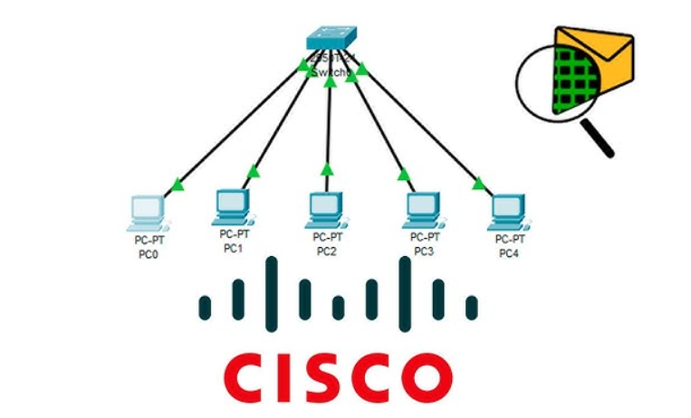

# 📡 Cisco Packet Tracer Labs for CCNA / Laboratorios de Cisco Packet Tracer para CCNA

## Overview / Descripción general

Este repositorio contiene una colección estructurada de laboratorios prácticos de redes diseñados bajo los lineamientos del plan de estudios de CCNA. El objetivo principal de este portafolio es demostrar habilidades prácticas en la arquitectura de infraestructura, enrutamiento seguro, optimización de switching y servicios de red mediante simulaciones detalladas en Cisco Packet Tracer.

---

## Repository Structure / Estructura del repositorio

El proyecto está organizado de manera eficiente para separar la documentación detallada de los archivos de producción:

* **`01_Labs-summaries/`**: Contiene la documentación completa, registros de configuración de CLI, comandos de verificación y capturas de pantalla paso a paso de cada topología.
* **`labs-(pkt)/`**: Almacena los archivos fuente `.pkt` originales listos para ser descargados, desplegados y probados en Cisco Packet Tracer.

---

## Core Technologies Covered / Tecnologías principales cubiertas

* **Switching Infrastructure / Infraestructura de conmutación**: Segmentación de VLANs, configuración de enlaces troncales bajo el estándar 802.1Q y enrutamiento Inter-VLAN utilizando metodologías tradicionales (Router-on-a-Stick) y modernas mediante interfaces virtuales de switch (SVIs) en equipos multicapa.
* **IP Routing / Enrutamiento IP**: Estrategias de enrutamiento estático, implementación de puertas de enlace por defecto y configuración de entornos de enrutamiento dinámico mediante adyacencias en OSPF Single-Area y RIPv2.
* **Network Services / Servicios de red**: Asignación automatizada y optimizada de direccionamiento IPv4 a través de Servidores DHCP y Agentes Relay DHCP, junto con la implementación de servicios de traducción de direcciones NAT y PAT.
* **Infrastructure Security / Seguridad de infraestructura**: Filtrado avanzado de tráfico de datos y aplicación de políticas de seguridad en la red perimetral mediante el despliegue de Listas de Control de Acceso (ACLs) tanto Estándar como Extendidas.

---
